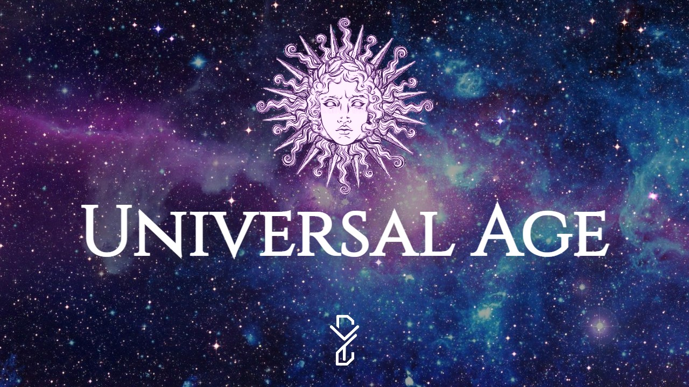
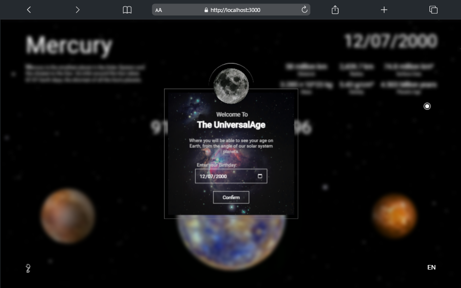
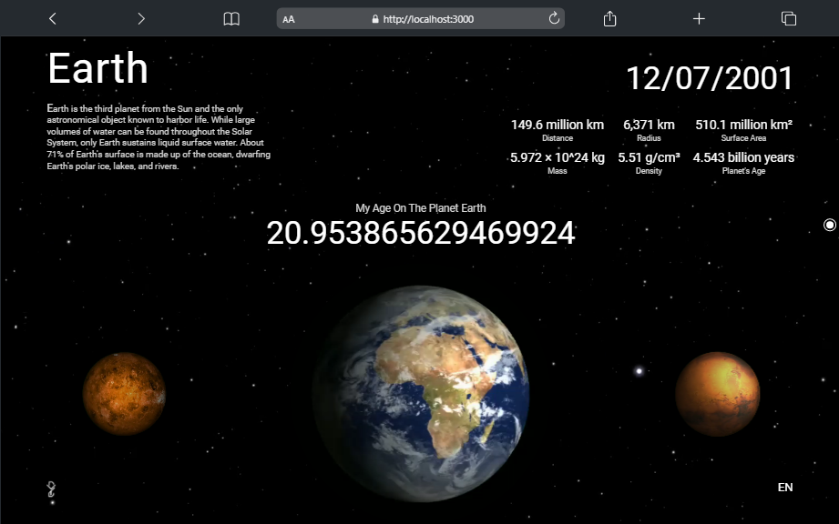

# Getting Started with Universal Age App:
 adding a littel bit of drama 👀😒

## Overview:

In the `Universal Age App` you'll be able to calculate your age in diffrent planets in our solar Systeme, relevant to the `Earth` with some information about every planet,.\
This app can support multi language (3 language).\
`en: English`, `fr: French(français)`, `ar: Arabic(العربية)`.

## Screenshots:
#### Moduel to input your `birthdate`.

#### Brows your age in diffrent planets.

